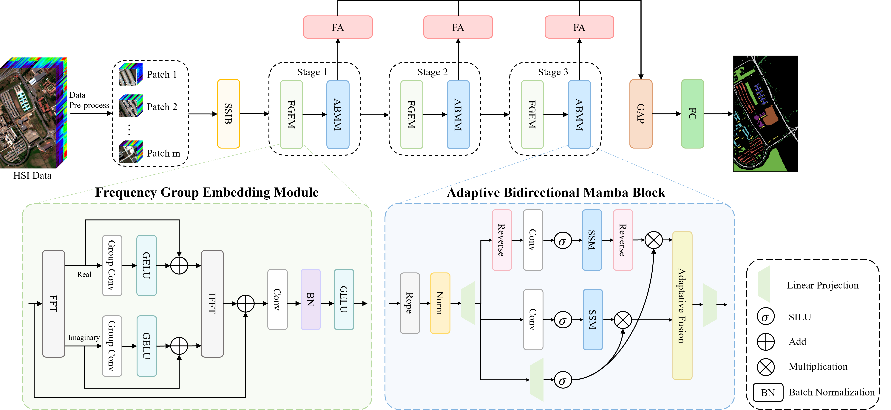

# 📖 FAHM: Frequency-Aware Hierarchical Mamba for Hyperspectral Image Classification (IEEE JSTARS 2025)

PyTorch codes for "[FAHM: Frequency-Aware Hierarchical Mamba for Hyperspectral Image Classification](https://ieeexplore.ieee.org/document/10877784)", **IEEE Journal of Selected Topics in Applied Earth Observations and Remote Sensing**, 2025.

- Authors: Peixian Zhuang, Xiaochen Zhang, Hao Wang, Tianxiang Zhang, Leiming Liu, and Jiangyun Li

### Overall
<div align=center>

</div>

### 🌱Abstract
>Convolutional Neural Networks (CNNs) and Transformers have garnered substantial attention in hyperspectral image (HSI) classification, and recently Mamba has made significant progress in modeling long sequences. However, existing Mamba-based approaches flatten 2D images into 1D sequences, inevitably disrupting 2D local dependencies, thereby disregarding the distinctive difference between high-frequency and low-frequency components in the frequency domain. For HSI tasks, these methods suffer from inherent receptive field limitations and insufficient exploitation of spectral information, resulting in unclear classification of regional boundaries and poor generalizability. To address these issues, we present a novel Frequency-Aware Hierarchical Mamba (FAHM) for HSI classification. Specifically, FAHM is comprised of three main parts: a Spatial-Spectral Interaction Block (SSIB), a Frequency Group Embedding Module (FGEM), and an Adaptive Bidirectional Mamba Block (ABMB). Building on the observation that the high-frequency component contains detailed features while the low-frequency information provides abundant high-level semantics, we design FGEM to enhance feature representation in the frequency domain. To prepare spectral–spatial contextual tokens for FGEM, we incorporate SSIB to extract shallow features, and ABMB is designed to capture spectral dependencies by modeling spectral variation bidirectionally. We construct our Mamba in a hierarchical manner, and refine multi-level features using a Feature Affinity (FA) module for improved accuracy. Experiments conducted on four HSI benchmark datasets show that the proposed FAHM outperforms eleven existing approaches in classification accuracy and model generalization.

### 📃 Requirements
>* Python == 3.8.19
>* pytorch == 2.4.0
>* causal-conv1d == 1.4.0
>* mamba_ssm==2.2.2

### 🥰 Citation	

**Please kindly cite the papers if this code is useful and helpful for your research.**
```
@article{zhuang2025fahm,
  title={FAHM: Frequency-Aware Hierarchical Mamba for Hyperspectral Image Classification},
  author={Zhuang, Peixian and Zhang, Xiaochen and Wang, Hao and Zhang, Tianxiang and Liu, Leiming and Li, Jiangyun},
  journal={IEEE Journal of Selected Topics in Applied Earth Observations and Remote Sensing},
  year={2025},
  volume={18},
  number={},
  pages={6299-6313},
  publisher={IEEE}
}
```
